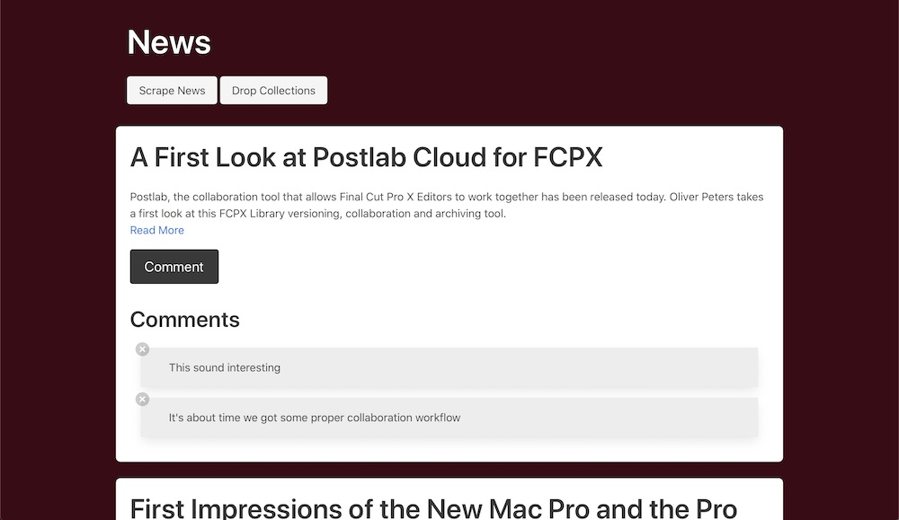

# News Scraper

A news scraping demonstration utilizing Cheerio and Axios to dig through site markup for storing in MongoDB with Mongoose ODM. This demo allows for nuking the Mongo collections, re-scraping, commenting, and deletion of comments. Designed with a mobile first approach with Bulma css framework.

## Challenges

- properly traversing page elements to loop over for desired content
- relizing a need to regex cleanup extra newline and tab characters that weren't apparent initially
- working with Mongo nosql coming from a MySQL background

### Technology

- Cheerio for digging through Axios responses for desired content
- Axios for requesting site markup to scrape
- NodeJs with Express
- Mongodb with Mongoose
- jquery for rendering
- Heroku deployed

